# **Institut Universitaire de Technologie \- Lille** 

# 

# Rapport IHM

# SAE2.01/02 

**Mangin.M , Vigneron.L , Viloda-Rivière.M**

11/06/2025  
BUT 1 Informatique \- Groupe C

**Sommaire :** 

[**I \- Description de la SAE :	3**](#i---description-de-la-sae-:)

[**II \- Choix de conception :	3**](#ii---choix-de-conception-:)

[A \- Page d'accueil :	3](#a---page-d'accueil-:)

[B \- Choix des séjour :	4](#b---choix-des-séjour-:)

[C \- Paramètres des critères :	5](#c---paramètres-des-critères-:)

[D \- Incompatibilités :	6](#d---incompatibilités-:)

[E \- Formation des binômes :	7](#e---formation-des-binômes-:)

[F \- Création des voyages :	7](#f---création-des-voyages-:)

[G \- Création des élèves :	8](#g---création-des-élèves-:)

[H \- Conclusion  :	9](#h---conclusion-:)

[**III \- Critères d’ergonomie :	9**](#iii---critères-d’ergonomie-:)

[A. Le guidage :	9](#le-guidage-:)

[B. La charge de travail :	10](#la-charge-de-travail-:)

[C. Le contrôle explicite :	10](#le-contrôle-explicite-:)

[D. L’homogénéité , la cohérence :	10](#l’homogénéité-,-la-cohérence-:)

[E. La signifiance des codes :	11](#la-signifiance-des-codes-:)

[**IV \- Répartitions du travail :	11**](#iv---répartitions-du-travail-:)

 

## 

##  **I \- Description de la SAE :**  

Pour rappeler le contexte, nous étions chargés de développer un outil d’aide pour un collège organisant, chaque année, des séjours linguistiques entre des établissements scolaires de France, d’Italie, d’Espagne et d’Allemagne. Nous devions prendre en compte plusieurs contraintes pour notre algorithme (partie Graphe et POO), ainsi que concevoir une interface permettant de modifier les paramètres de l’algorithme afin d’orienter la solution (partie IHM). Cette interface est destinée uniquement aux professeurs, et non aux élèves. 

##  **II \- Choix de conception :**  

### **A \- Page d'accueil :**  

| Prototype | JavaFX |
| ----- | ----- |
| 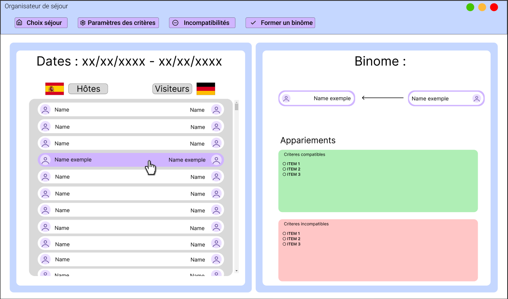   | 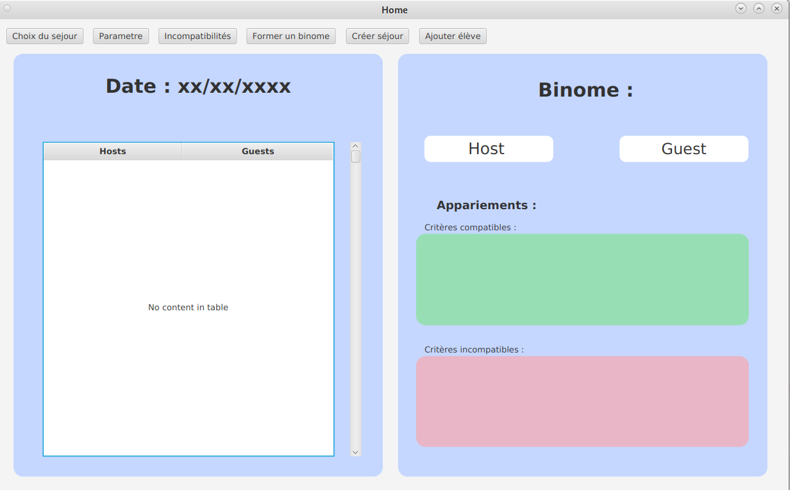 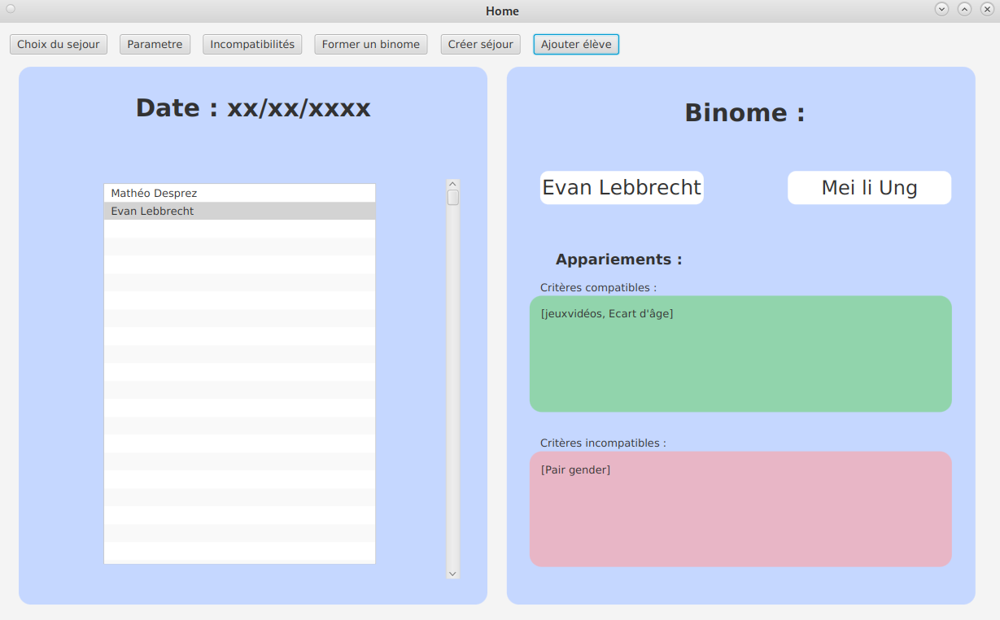 |

Pour la page principale ou page d'accueil nous avons décidé de visualiser directement les binômes d’un voyage, passé par défaut. Sur la gauche nous avons la liste des binômes , avec la date du séjour ainsi que les drapeaux correspondant chacun au pays hôtes et visiteurs. Quand nous cliquons sur un binôme, nous avons sur la droite en informations d’appariements, c'est-à-dire leur noms ainsi qu’une liste de leur critères compatibles et incompatibles, que nous avons décidés de mettre en vert et rouge pour que ce soit plus clair, lisible et intuitifs pour l'utilisateur ( un professeur ). Sur le haut de la page nous avons un menu avec des boutons qui affiche, en popup,  les autres pages importantes. Nous avons choisi des noms assez intuitifs , comme “ paramètres des critères” pour afficher la page de paramètres pour modifier certains paramètres de critères, afin de faciliter l’expérience utilisateurs, et de fluidifier leurs requêtes/ tâches.   
Nous avions décidés de visualiser les binômes sous formes de tableaux, hors pour être cohérent avec notre code de POO, nous avons finalement visualiser les binômes de la forme “Hôtes/Visiteurs” avec toutes les informations plus précises sur les binômes sur la partie de droites à la sélections de celui-ci. 

### **B \- Choix des séjour :**

| Prototype | JavaFX  |
| :---: | :---: |
| 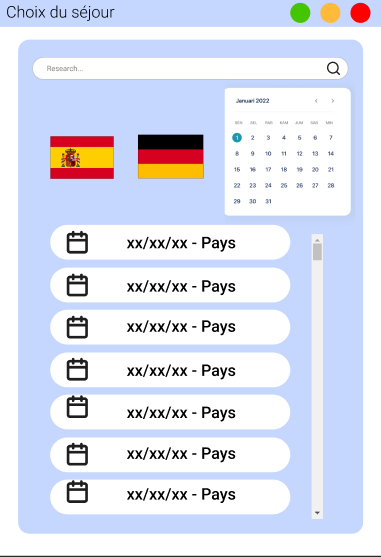  | 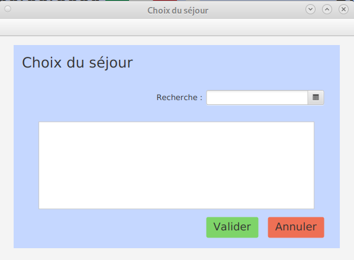 |

Pour le choix du séjour , nous avions décidé de faire apparaître en popup, à l'utilisation du bouton du même nom dans la barre de menue. Pour cette fenêtre nous avons décidé d’aller à l'essentiel, pour ne pas surcharger l’utilisateur en information. Au début nous voulions faire une recherche par pays et / ou par date, hors lors de la conception sur *SceneBuilder*  nous avons décidé de nous concentrer sur la recherche par date. Un fois une date inscrite, nous avons la liste de tous les séjours ayant eu lieu à cette même date, avec les pays concernés en titre de celles- ci.Nous avons aussi rajouté des boutons “Valider” et “Annuler”, pour sauvegarder ou non les modifications ( ces boutons réapparaîtront dans plusieurs autres fenêtres pour les mêmes raisons, c’est à dire sauvegarder ou non les modifications). Comme pour tous les popup pour revenir sur la page d'accueil, il faut juste fermer celle-ci à l'aide de la croix en haut à gauche.

### **C \- Paramètres des critères :** 

| Prototype | JavaFX  |
| ----- | :---: |
| 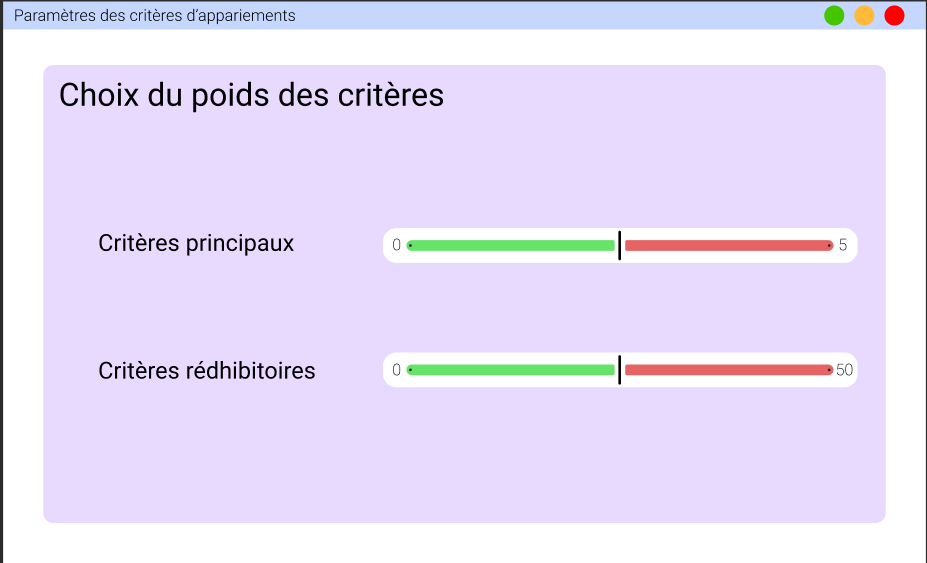  | 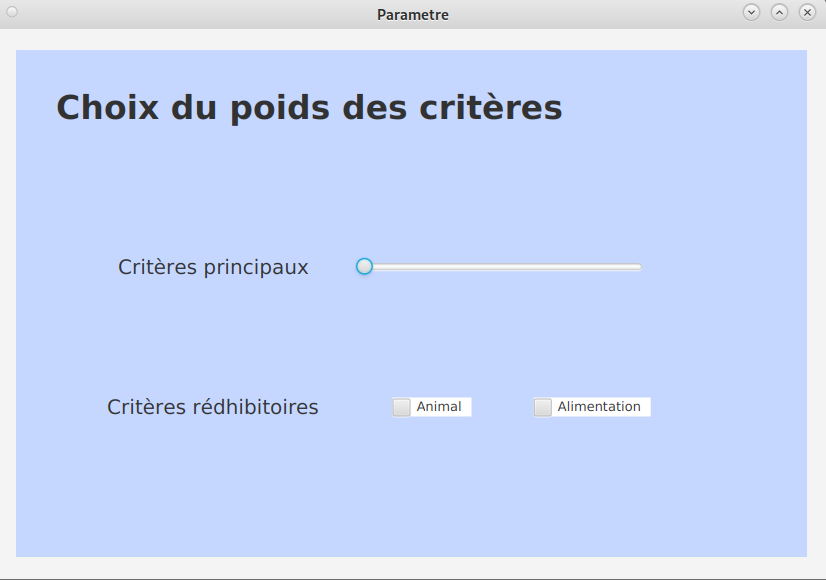  |

En ce qui concerne, les paramètres de critères, nous avions plusieurs idées. Tout d’abord, nous voulions utiliser des *SlideBars graduée*, pour définir le poids de critères principaux et rédhibitoires. Finalement, nous avons opté pour une *SlideBar graduée* seulement pour les critères principaux et 2 *CheckBox* en ce qui concerne les critères rédhibitoires. De cette façon, nous facilitons l’utilisation de ces paramètres et surtout leur lisibilité.   
Cette fenêtre impactera directement l’algorithme, pour changer ou non les compatibilités des hôtes et visiteurs

### **D \- Incompatibilités :** 

| Prototype | JavaFX  |
| :---: | :---: |
| 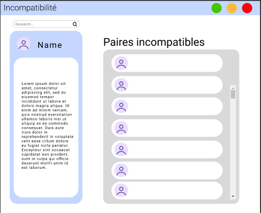  | 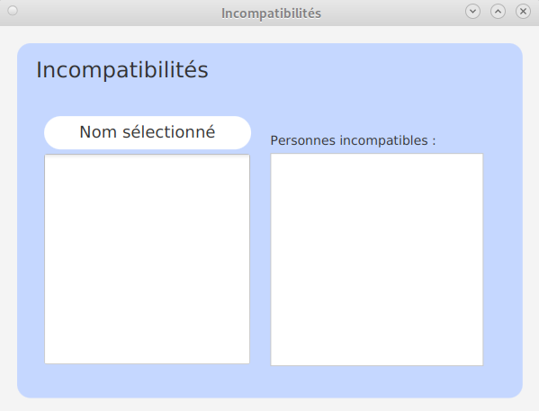  |

En ce qui concerne les incompatibilités, cette page servira à visualiser les paires Hôtes/ Visiteur et Visiteur/Hôtes incompatibles avec le pire score d’affinités. Pour ce faire, nous avons décidé de mettre une barre de recherche, puis à sa droite nous avons la liste des personnes ayant un scores d’affinités élevés 

### **E \- Formation des binômes :**  

| Prototype | JavaFX  |
| :---: | :---: |
| 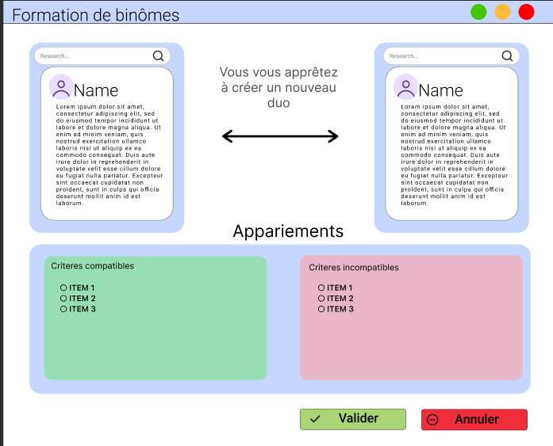  | |

En ce qui concerne la formation de binôme, nous avons plusieurs choix qui s’offrent à nous. Tout d'abord nous avons l’algorithme qui forme des binômes automatiquement, ou alors nous pouvons forcer la création de binôme avec cette fenêtre. Celle-ci est composée, de 2 onglets de recherches de de part et d'autres de la page, permettant de sélectionner les deux parties du binôme , avec en bas de la page leur liste de critères  compatibles et incompatibles ainsi que 2 boutons “ Valider” ou “Annuler” afin de sauvegarder ou non la sélection de binôme. 

### **F \- Création des voyages :**  

| Prototype | JavaFX  |
| :---: | :---: |
| 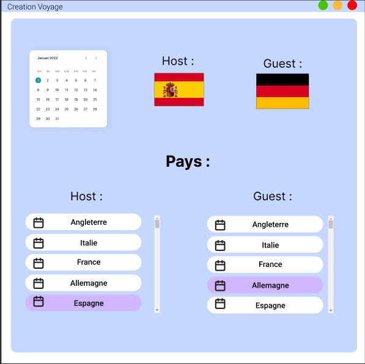  | 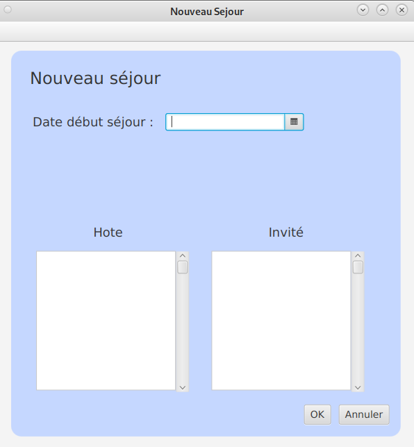  |

Pour ajouter/créer un nouveau voyage nous avons créé cette fenêtre ( toujours disponible depuis la page d'accueil ). Cette page est composée d’un calendrier afin de sélectionner les dates du séjour, ainsi que deux listes de pays hôte et visiteur. Nous retrouvons encore nos boutons “Annuler” et “OK” pour sauvegarder ou non, la création de ce nouveau voyage. Nous avons par la suite décidé de retirer les *ScrollBars* car celles-ci sont intégrées aux *ListViews .*

### **G \- Création des élèves :**  

| Prototype | JavaFX  |
| :---: | :---: |
| 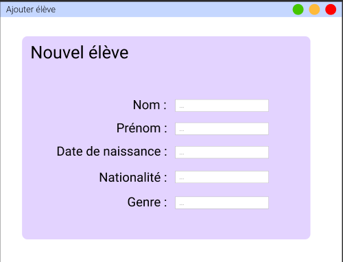  | 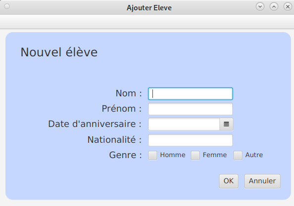 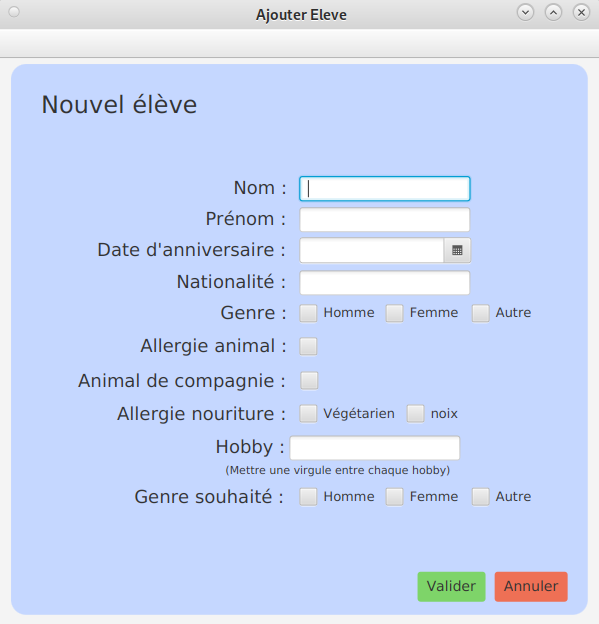 |

Comme la création d’un voyage, nous avons la possibilité d’ajouter des élèves , dans les classes déjà définies. Cette fenêtre est encore et toujours disponible depuis la page d'accueil. Pour la première version, elle se compose de différents *TestField*, afin d’entrer le nom , prénom, date de naissance, nationalités et genre de ce nouvel élève. Avec encore et toujours, les boutons “ Annuler” et “OK” pour sauvegarder ou non notre ajout. En ce qui concerne la dernière version, nous avons décidé d’être encore plus précis dans l’ajout d’un élève, en ajoutant la nationalités, les allergies, les régimes alimentaires,  les hobbies et enfin le genre souhaité ( pour effectuer les paires ).  

### **H \- Conclusion  :**  

Pour résumer, nous avons une page principale prenant en compte qu’un seul séjour et affichant les binômes avec leur critères d'appariement ainsi qu’un menue principale permettant d’accéder aux autres pages. Ces autres pages sont représentées sous forme de popups, s’affichant devant la page principale. Grâce au popups nous avons la possibilité de d’ouvrir plusieurs pages en simultané, et cela ne surcharge pas d’information l’utilisateur. 

## **III \- Critères d’ergonomie :**  

1. ### **Le guidage :** 

Définition :  L’utilisateur doit être guidé dans ses actions et savoir à tout moment ce qu’il peut faire. 

Pour répondre à ce critère , nous avons mis des boutons “ Valider” et “Annuler” en bas de page de chaque permettant la modification des binômes, comme pour les paramètres, la formation de binômes ici dessous mais encore l’ajout de nouvel élèves , séjour, etc. 

2. ### **La charge de travail :** 

Définition :  L'interface doit minimiser l’effort mental et physique de l’utilisateur. 

Pour minimiser la charge de travail des utilisateurs de cette interface nous avons décidé de mettre toutes les options de modifications dans un menu avec des noms assez clairs et concis, avec une page par modifications possibles pour ne pas surcharger l’utilisateur d’information et donc d’effort mental.  

3. ### **Le contrôle explicite :** 

Définition :  L'utilisateur doit avoir le contrôle sur ses actions et son système. 

L'algorithme, et surtout les choix de poids des critères, offre la l'utilisation un contrôle partielle de algorithme derrière notre interface.   

4. ### **L’homogénéité , la cohérence :**  

Définition :  Les éléments similaires doivent se comporter de la même manières 

Toutes les pages de notre interface se comportent de la même manière, c’est à dire ; Elles ont tous des boutons “Valider” et “Annuler” fonctionnant de la même manière et pour les mêmes raisons , sauvegarder ou non les modifications faites, ils sont de la même forme, de la même couleur et au même endroits sur toutes les pages de notre interface.

5. ### **La signifiance des codes :**  

Définition :  Les icônes, couleurs et symboles doivent avoir une signification claire et intuitive.  

Pour que ce soit clair, nous avons mis les critères favorables à la création des binômes en vert et ceux non favorable en rouge, ainsi que les boutons de sauvegarder ou non “Valider “ et “Annuler”.  

Pour les autres critères, comme la gestion des erreurs, nous n’avons pas eu le temps de le prendre en compte. Au vu des lacunes plus ou moins grandes des membres de l’équipe, nous avons pris énormément de temps à créer les interfaces. 

## **IV \- Répartitions du travail :**  

Etant donné nos lacunes à tous, en ce qui concerne l’IHM,  nous avons décidé de répartir le travail selon les compétences de chacun. Maxence Mangin, s’est occupé d’une large partie de l’interface ( partie IHM ), quant à Loïse Vigneron d’une large partie du développement ( partie POO). En ce qui concerne Manon Viloda–Rivière, elle était là sur les tâches qui demandait son aide, notamment la partie graphes et la rédaction de documents.  

## Liens utiles

### Mockups Figma

[Lien de la maquette Figma](https://www.figma.com/design/PzTIG5tQSuaEj33cxHbrPK/IHM-Prototype?node-id=0-1&p=f&t=SHTLE6xYAL84BqMj-0)  
[Lien du prototype interactif](https://www.figma.com/proto/PzTIG5tQSuaEj33cxHbrPK/IHM-Prototype?node-id=1-10012&t=xTK8EiqIhbW1l7BJ-0&scaling=min-zoom&content-scaling=fixed&page-id=0%3A1)

### Vidéo de l'application 
[Lien de la vidéo](./videoPROCESSED.mp4)

